# 🧠 RAG Chatbot API with Cohere & Qdrant


This repository contains the backend API for a powerful **Retrieval-Augmented Generation (RAG)** chatbot. The application is built using **FastAPI** and leverages the cutting-edge capabilities of **LlamaIndex**, **Cohere's** embedding and generation models, and a **Qdrant** vector database to provide accurate, context-aware answers from a private knowledge base.

---

## 🚀 How It Works: The RAG Architecture

Retrieval-Augmented Generation (RAG) enhances the power of Large Language Models (LLMs) by grounding them in external knowledge. Instead of just relying on its pre-trained data, the LLM can "look up" relevant information from a custom database before answering a question. This dramatically reduces hallucinations and allows the chatbot to answer questions about specific, private data.

Our implementation follows a two-stage process: **1. Indexing** and **2. Retrieval & Generation**.

### Visualizing the RAG Pipeline

Here is a high-level diagram illustrating the entire workflow, from setting up the knowledge base to answering a user's query.

```mermaid
graph TD
    subgraph "Phase 1: Indexing (One-Time Setup)"
        A["📚 Your Documents<br>(PDFs, TXT, etc.)"] --> B("Chunking<br>Split into smaller pieces");
        B --> C{"Embedding<br>via Cohere embed-v3.0"};
        C --> D[("Qdrant Vector DB<br>Store vectors & metadata")];
    end

    subgraph "Phase 2: Querying (Real-Time)"
        E["👨‍💻 User Asks a Question"] --> F{"Embedding<br>via Cohere embed-v3.0"};
        F --> G["Similarity Search<br>in Qdrant"];
        D -- "Fetches Relevant Chunks" --> G;
        G --> H{"Prompt Augmentation<br>Combine Question + Context"};
        H --> I("🧠 Cohere Command R+<br>Generate Answer");
        I --> J["✅ Final Answer"];
        E -.-> H;
    end

    style A fill:#D5F5E3,stroke:#2ECC71
    style D fill:#D6EAF8,stroke:#3498DB
    style I fill:#FADBD8,stroke:#E74C3C
    style J fill:#E8DAEF,stroke:#8E44AD
```



---

## 🛠️ Step-by-Step Breakdown

### Stage 1: Building the Knowledge Base (Indexing)

This is the foundational, one-time process where we prepare our custom data for the chatbot.

**Step 1: Document Loading & Chunking**
Your source documents (e.g., company policies, project documentation, personal notes) are loaded and broken down into smaller, manageable chunks. This is crucial because LLMs have a limited context window, and smaller chunks provide more specific context.

**Step 2: Embedding**
Each text chunk is converted into a numerical representation called a **vector embedding**. We use **Cohere's `embed-english-v3.0`** model for this, which is highly effective at capturing the semantic meaning of text.
> "The project deadline is Friday" ➡️ `[0.12, -0.45, 0.89, ...]`

**Step 3: Storing in a Vector Database**
These vector embeddings, along with their original text chunks, are stored and indexed in a **Qdrant** vector database. Qdrant is optimized for incredibly fast and efficient similarity searches on millions or even billions of vectors.

### Stage 2: Answering a Query (Retrieval & Generation)

This is the real-time process that occurs every time a user asks a question.

**Step 1: Embed the User's Query**
The user's question is converted into a vector embedding using the *exact same* Cohere model used for indexing. This ensures that the query and the documents are in the same "semantic space."

**Step 2: Retrieve Relevant Context**
The query vector is used to search the Qdrant database. Qdrant performs a similarity search (like a "semantic search") and returns the top `k` most relevant text chunks from the knowledge base.

**Step 3: Augment the Prompt**
The retrieved text chunks (the "context") are combined with the user's original question to create a new, detailed prompt.
> **Original Question:** "When is the project due?"
> **Retrieved Context:** "From doc_A.pdf: The project deadline is Friday..."
>
> **Augmented Prompt:**
> ```
> Context: "From doc_A.pdf: The project deadline is Friday..."
> Question: "When is the project due?"
> Please answer the question based on the provided context.
> ```

**Step 4: Generate the Final Answer**
This augmented prompt is sent to a powerful LLM, **Cohere's `command-r-plus`**. Because the model now has the exact context it needs, it can generate a precise and factual answer instead of guessing.
> **Final Answer:** "The project deadline is Friday."

---

## 💻 Tech Stack & API

This project is built with a modern, robust stack:

| Component | Technology | Purpose |
| :--- | :--- | :--- |
| **Web Framework** |  | For creating the high-performance API. |
| **Orchestration** |  | To connect and manage the RAG components. |
| **LLM & Embeddings** |  | For text generation and creating vector embeddings. |
| **Vector Database** |  | For storing and retrieving vector embeddings. |
| **API Server** |  | The lightning-fast ASGI server for FastAPI. |

### API Endpoints

The API exposes two simple endpoints:

| Method | Endpoint | Description |
| :--- | :--- | :--- |
| `GET` | `/` | A root endpoint to check if the API is running and the setup is complete. |
| `POST` | `/query` | The main endpoint to ask a question. Expects a JSON body with a `question` key. |

---

## ⚙️ Setup & Installation

To get a local copy up and running, follow these steps.

### 1. Prerequisites
- Python 3.9+
- A Cohere API Key
- A running Qdrant instance (Cloud or local Docker) with its URL and API Key.

### 2. Installation

1.  **Clone the repository:**
    ```sh
    git clone https://github.com/RautRitesh/RAG-FASTAPI.git
    cd RAG-FASTAPI
    ```

2.  **Create a virtual environment and activate it:**
    ```sh
    python -m venv venv
    source venv/bin/activate  # On Windows, use `venv\Scripts\activate`
    ```

3.  **Install the required dependencies:**
    ```sh
    pip install -r requirements.txt
    ```
    *(Note: You will need to create a `requirements.txt` file from the imports in `main.py`)*

4.  **Create a `.env` file** in the root directory and add your secret keys:
    ```env
    CO_API_KEY="your_cohere_api_key"
    QDRANT_URL="your_qdrant_instance_url"
    QDRANT_API_KEY="your_qdrant_api_key"
    ```

5.  **Run the application:**
    ```sh
    uvicorn main:app --reload
    ```
    The API will now be running at `http://127.0.0.1:8000`.

---

## 🚀 Usage Example

You can interact with the API using `curl` or any API client like Postman.

### Using `curl`

```sh
curl -X POST "[http://127.0.0.1:8000/query](http://127.0.0.1:8000/query)" \
-H "Content-Type: application/json" \
-d '{
      "question": "How to take care of a skin ?"
    }'
```

### Expected Response

```json
{
  "answer": "The main benefit of using a RAG model is its ability to provide accurate, context-aware answers by retrieving information from an external knowledge base, which significantly reduces the chances of the model hallucinating or providing incorrect information."
}
```

---

## 🤝 Contributing

Contributions are welcome! If you have a suggestion that would make this better, please fork the repo and create a pull request.

1.  Fork the Project
2.  Create your Feature Branch (`git checkout -b feature/AmazingFeature`)
3.  Commit your Changes (`git commit -m 'Add some AmazingFeature'`)
4.  Push to the Branch (`git push origin feature/AmazingFeature`)
5.  Open a Pull Request

---

## 📜 License

Distributed under the MIT License. See `LICENSE` for more information.
